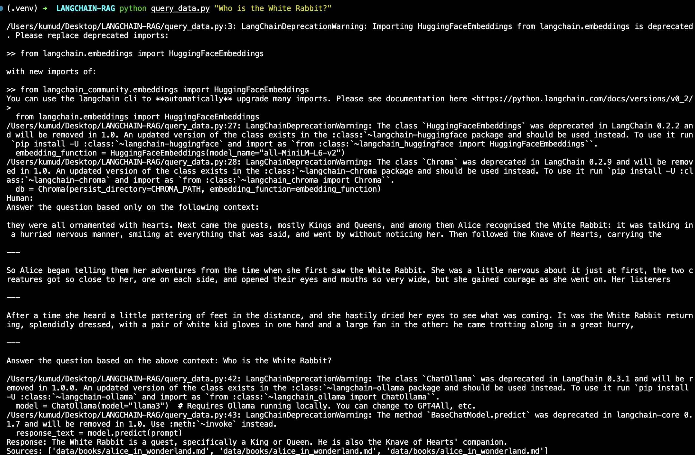

# 📚 LangChain RAG with Local LLM (Ollama) & ChromaDB

This project demonstrates a **Retrieval-Augmented Generation (RAG)** pipeline using:

- 💬 Local LLMs served via [Ollama](https://ollama.com/)
- 🔎 ChromaDB for local vector storage
- 🧠 HuggingFace embeddings (`all-MiniLM-L6-v2`)
- ⚙️ LangChain to orchestrate the components

---

## 🧱 Project Structure

```bash
LANGCHAIN-RAG/
├── data/                # Input `.md` (Markdown) files go here
├── create_database.py   # Embeds data and populates ChromaDB
├── query_data.py        # Script to ask questions
├── requirements.txt     # Project dependencies
└── README.md            # Project documentation


🚀 Getting Started
1. Start the Ollama server
Make sure Ollama is installed and running locally:
ollama serve

2. Pull a language model (e.g., LLaMA 3)
ollama run llama3
This ensures the model is available for inference.

3. Install dependencies
We recommend using a virtual environment:
python -m venv .venv
source .venv/bin/activate  # On Windows: .venv\Scripts\activate
pip install -r requirements.txt

4. Prepare your data
Place your .md files in the data/ folder. For example:

data/
├── alice_in_wonderland.md
Then run:
python create_database.py
This will embed the Markdown files and store them in ChromaDB locally.

5. Ask questions
python query_data.py "Who is the White Rabbit?"
You’ll get answers based only on the context in your Markdown files.

📦 Dependencies (requirements.txt)

python-dotenv==1.0.1
langchain==0.2.2
langchain-community==0.2.3
langchain-openai==0.1.8
unstructured==0.14.4
chromadb==0.5.0
openai==1.31.1
tiktoken==0.7.0

## 🖼️ Demo




📌 Notes
Works completely offline with local models (no OpenAI API required).

Uses all-MiniLM-L6-v2 for embedding via HuggingFace.

You can extend it to support PDFs, DOCX, or other file types using LangChain’s unstructured loader.

The vector DB is persisted under the default Chroma path (./chroma/ or similar).

